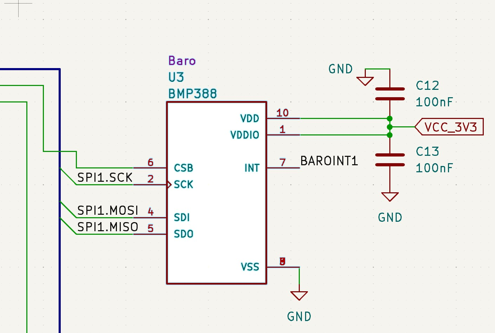

    loop {
        info!("Reading data...");
        let Bmp3RawData { raw_temperature, raw_pressure } = sirin.baro.io().read_raw_data().await.unwrap();
        info!("Read {} temperature and {} pressure", raw_temperature, raw_pressure);*/
        let Bmp3Readout { temperature, pressure } = sirin.baro.read().await.unwrap();
        info!("Read {} degrees Celsius at {} pascals", temperature.value, pressure.value);
        /*let err = sirin.baro.io().read_reg(RegErrReg).await.unwrap();
        info!("Err {:b}", err);
        let status = sirin.baro.io().read_reg(RegStatus).await.unwrap();
        info!("Status {:b}", status);*/
        Timer::after_millis(500).await;
    }
    
    loop {
        info!("high");
        led.set_high();
        Timer::after_millis(500).await;

        info!("low");
        led.set_low();
        Timer::after_millis(500).await;
    }

| Pin| Name | I/O Type | Description |
| -----------|-----------| ----------- |----------|
|1|VDDIO|Supply|Digital Interface Supply|
|2|SCK|ln|Serial clock input|
|3|VSS|Supply|Ground|
|4|SDI|ln/Out|Serial data output|
|5|SDO|ln/Out|Serial data output|
|6|CSB|Out|INT output|
|7|INT|Out|INT output|
|8|VSS|Supply|Ground|
|9|VSS|Supply|Ground|
|10|VDD|Supply|Analog supply|

