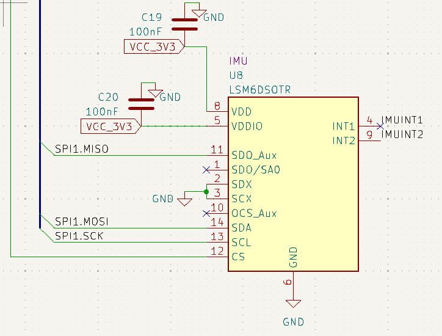

# IMU
## LSM6DSV (Mode 1)
### [Datasheet](https://www.st.com/resource/en/datasheet/lsm6dsv.pdf)

## Description
This is a 6-axis Inertial Measurement Unit. It contains a 3-axis accelerometer with a range of ±16 *g*, and a 3-axis gyroscope with a range of ±4000 dps(degree per second).

## Pins

| Pin # | Name | Description |
|---------|-------|--------------|
| 1 | SDO/SA0 | SPI 4-wire interface serial data output (SDO)
| 4 | INT1 | Programmable interrupt in SPI
| 9 | INT2 | Programmable interrupt 2 (INT2) / Data enable (DEN)
| 12 | CS | SPI mode selection   (1: SPI idle mode communication enabled;  0: SPI communication mode disabled)
| 13 | SCL | SPI serial port clock (SPC)
| 14 | SDA | SPI serial data input (SDI) 3-wire interface serial data output (SDO)

Pin 11 should not be connected, this is a mistake